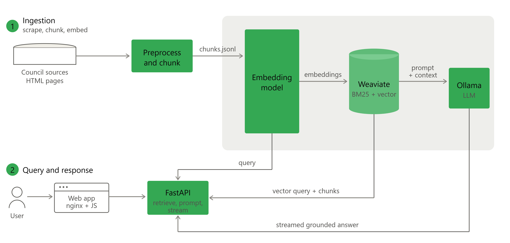

> [!NOTE]
> Blaai is now live at [blaai.ie](https://www.blaai.ie/)

# blaai

A retrieval-augmented chatbot that answers questions about local government services in Waterford, grounded in the council's own published pages, running entirely on self-hosted models.

This is a personal project to explore ethical applications of LLMs, it is privacy focused, utilising a local LLM, lightweight, non tracking and providing a public good.

## Performance Evaluation

I built out a 26 question evaluation spanning routine, multitopic, out of scope and adversarial queries, each with extended sample answers and a gold standard source drawn from the database.

I then performed scripted testing measuring:

* Recall - Is the gold standard source cited, and at what rank?
* Refusal - Are out-of-scope and adversarial questions declined?
* Groundedness - Faithhfulness to the source material
* Correctness - Accuracy

Groundedness and correctness were assessed using LLM-as-a-Judge, a locally hosted LLM graded yes/partial/no against the retrieved context and the reference answer.

### Results

Retrieval recall (gold source URL cited): 100.0%
  mean rank when retrieved: 2.72

Refusal accuracy: 87.5% 

Answer quality (qwen2.5:7b judge):
| Metric | Mean | Yes | Partial | No |
| --- | --- | --- | --- | --- |
| *groundedness* | 0.53 | 2 | 15 | 1 |
| *correctness* | 0.42 | 1 | 13 | 4 |

### Conclusion

Recall and refusal are quite strong, especially given the limitations of the system and source material. However The system is not giving wholly correct answers, diving into the results the typical answer is partial. Not entirely inaccurate just not whole.

I believe this can be improved by expanding data ingestion to include .pdf and .docx files, and changing chunking parameters to increase the size of chunks embedded. 

## Architecture and Tools

Scraped civic content is chunked and embedded into a Weaviate vector store, which serves hybrid search (dense vectors + BM25 keyword matching) so both semantic and exact-term queries land. 

A FastAPI backend handles retrieval and prompt construction; answers are generated by a locally-hosted LLM via Ollama, with no third-party inference API. A vanilla-JS frontend talks to the API directly, and the whole stack runs behind nginx on a single Linux VPS, wired together with Docker Compose.

## Roadmap
- [x] Scope
- [x] Project skeleton
- [x] Containerise + verify
- [x] Build + test scraper
- [x] Source data
- [x] Extract + Chunk
- [x] Review gate
- [x] Schema
- [x] Retrieval
- [x] Generation
- [x] Response Hardening
- [x] Citation space in UI
- [x] Streamed token responses
- [x] Evaluation set 
- [x] Hardening
- [x] Frontend 
- [x] Deployment
- [ ] V2 Scraper: include pdf + docx
- [ ] Improve Chunking: Larger chunks should improve context
